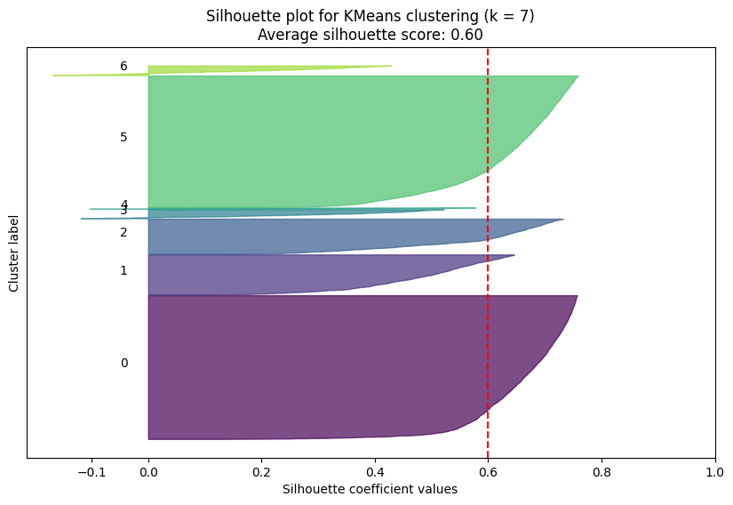
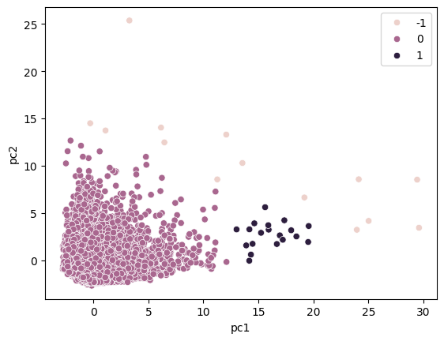

# Performing Credit Card Customer Segmentation using Unsupervised ML Clustering Methods

## Group members

- Markus Buan
- Yasamin Mazaheri
- Vishal Patel
- Akash Premkumar
- Michael Tang

# Abstract 


The financial industry has witnessed a significant surge in the number of individuals obtaining credit card accounts in recent years. This trend necessitates the development of sophisticated analytical tools that can provide banks with valuable insights into customer behaviors and spending patterns. Traditionally, the FICO score has been the primary metric used by banks to assess the creditworthiness of credit card holders. However, the factors that go into a FICO score are weighted disproportionally, making it a misleading indicator of a customer's financial behavior at times.
In this study, we propose a novel approach to customer segmentation using a dataset comprising 8,950 credit card holders, characterized by 17 distinct features that encapsulate their spending habits and credit usage. Our objective is to employ advanced clustering algorithms to categorize customers into distinct groups based on their spending behaviors and credit card usage patterns. By doing so, we aim to transcend the limitations of traditional creditworthiness assessments and provide a more nuanced understanding of customer segments.The segmentation results from our optimal clustering algorithm may offer banks a granular view of their customer base, enabling them to tailor marketing strategies and customize services more effectively. For instance, banks can leverage these insights to design targeted marketing campaigns for new card applications or to create personalized rewards programs that resonate with specific customer segments. Additionally, this segmentation can aid in risk assessment, fraud detection, and the development of financial products that cater to the unique needs of different customer groups. Our study will utilize rigorous statistical methods to ensure the validity and reliability of the clustering results. We will also discuss the implications of our findings for both theoretical and practical applications in the banking and financial services industry. By providing a comprehensive framework for customer segmentation based on credit card spending habits, our research aims to contribute to the ongoing efforts to enhance customer relationship management and marketing efficiency in the financial sector.

# Background


With the rise of the Internet and e-commerce, credit card datasets have been increasingly studied using machine learning algorithms methods to gain insight into fraud detection problems. Datasets with credit card transaction details are used to discover what kinds of transactions can be identified as fraud in both unsupervised and supervised techniques<a name="carcillo1"></a>[<sup>[1]</sup>](#ref1). Supervised techniques use existing labels of historical transactions to predict the probability of a fraudulent transaction, while unsupervised techniques use outliers of the dataset to identify fraud. Clustering, such as the k-means algorithm used in unsupervised outlier detection for fraud data, may utilize features such as average transaction spending and total transactions over a certain time range. We are also interested in using unsupervised learning to answer a problem, but instead of only tracking customer spending using transaction datasets, we also need features that entail credit card payment behavior. 


The dynamic and complex nature of fraud necessitates equally adaptive and innovative detection strategies. underscore the significance of incorporating streaming active learning strategies into real-life fraud detection systems. Such approaches have been instrumental in significantly elevating the precision of fraud detection mechanisms, showcasing the critical role of real-time, responsive methodologies in staying ahead of fraudulent activities<a name="carcillo2"></a>[<sup>[2]</sup>](#ref2).

Moreover, the task of marketing effectively to the right customer segments is crucial for sustainable growth across industries. Here, unsupervised machine learning offers a valuable tool, enabling the identification and grouping of customers with similar characteristics<a name="van"></a>[<sup>[3]</sup>](#ref3). For instance, hierarchical clustering algorithms can be used to group similar objects together based on distance metrics, with the optimal number of clusters discernible through the elbow method. By combining credit card spending and payment variables, we can use unsupervised methods like clustering to group a customer based on how similar in creditworthiness or risk levels they are to other customers. This multifaceted approach not only aids in fraud detection but also enriches customer relationship management and targeted marketing strategies, offering a pathway to enhanced security and business growth.

# Problem Statement

The research problem addressed in this study is the development of a nuanced and effective method for segmenting credit card customers based on their usage patterns. The conventional metric for assessing customer credit behavior, the FICO score, relies heavily on credit history, which is tracked by various credit reporting agencies<a name="avery"></a>[<sup>[4]</sup>](#ref4). However, this approach is fraught with challenges, as discrepancies between the agencies can lead to inconsistencies in FICO scores, thereby rendering it an incomplete and sometimes misleading metric for understanding customer behavior.

To address this gap, our proposed solution involves the creation of a clustering algorithm that specifically focuses on the spending habits of credit card holders. By doing so, we aim to eliminate the extraneous variables that the FICO score encompasses and provide a more direct and insightful analysis of customer spending behavior. Our approach involves the application of several clustering algorithms, including KMeans, DBSCAN, and Gaussian Mixture Models, to determine which factors are most indicative of customer segmentation. This will enable us to categorize customers into distinct groups based on their credit card usage patterns, thereby offering valuable insights into different customer profiles.

For instance, we anticipate that a customer with low `PURCHASES_FREQUENCY`, high `BALANCE`, high `MINIMUM_PAYMENTS`, and low `TENURE` may be classified into a cluster representing low-spending and higher-risk individuals. In contrast, a customer with high `PURCHASES_FREQUENCY`, high `CREDIT_LIMIT`, and high `PRCFULLPAYMENT` might be placed in a cluster indicative of high-spending and lower-risk individuals. By employing clustering metrics such as the silhouette score, the Davies-Bouldin Index, and the Calinski-Harabasz Index, we can ensure that the quality of the clusters produced is quantifiable, thereby enhancing the measurability and rigor of our clustering results.

Our research methodology is designed to be both replicable and thorough. By utilizing a well-defined clustering algorithm and a clear set of parameters, we aim to create a framework that other researchers can apply to the same dataset to achieve similar results, thereby ensuring the replicability of our study. Furthermore, our approach provides a clear and logical framework for addressing the research problem, with all variables and controls appropriately defined and mutually supportive. This research not only offers a more nuanced understanding of credit card customer behavior but also has practical implications for targeted marketing strategies, risk assessment, and the development of personalized financial products in the financial sector.

In conclusion, our study aims to contribute to the existing body of knowledge by providing a comprehensive and detailed analysis of credit card customer segmentation. Through the application of advanced clustering algorithms and a rigorous research methodology, we hope to offer valuable insights that can inform both theoretical and practical applications in the banking and financial services industry.

# Data

- Dataset Link: https://www.kaggle.com/datasets/arjunbhasin2013/ccdata/data 
- The dataset contains 8950 observations (unique customer IDs each representing one customer’s credit card information), and 18 features. These features include customer ID (`CUST_ID`), balance, balance frequency, purchases, one-off purchases, installments purchases, cash advance, purchase frequency, one-off purchase frequency, purchase installment frequency, cash advance frequency, cash advance transactions (`CASHADVANCETRX`), purchase transactions (`PURCHASES_TRX`), credit limit, payments, minimum payments, percent of full payments (`PRCFULLPAYMENT`), and tenure.
- An observation consists of the unique customer ID’s credit card information
- Some critical variables would be balance, purchases, purchase frequency, and credit limit. The balance is given as a float and it represents the available balance left in their account. The purchase frequency is also a float in the range of 0 and 1, where 0 is not frequently purchased and 1 is frequently purchased, and the credit limit is an integer and it represents the customer ID’s credit card limit.
- This dataset does not require much data cleaning to be ready to use, however, many of the features are on different scales. For example, the frequency is on a scale from 0 to 1, and the balance and payments are on a scale of $1:1. Some normalizations may be required to ensure the features are on a uniform scale. This is important when we run a clustering algorithm, as everything should be equally weighted to accurately find any trends or which features may be more important. In addition, data points with missing values will either be dropped completely or taken into account when used for a specific variable.
- Some steps we took to clean the data included removing the customer ID, since it is unique for each dataset and does not provide useful information for clustering, as there is no other personally identifiable information that we used.
- For the columns with many null values: In our case, this was applicable to the `MINIMUM PAYMENTS COLUMN`, we replaced the null values with 0, since no payment history would be equivalent to a minimum payment of $0. We dropped rows that contained the rest of the missing values, which only totaled to 1 other missing value in the `CREDIT_LIMIT` column.
- Our dataset does contain a large portion of 0s, and we recognize how this could affect our clustering algorithms. However, many of these 0 values are meaningful and significant. For example, many columns describe the frequency of certain customer habits, such as: `BALANCE_FREQUENCY`, `ONEOFFPURCHASESFREQUENCY`, `PURCHASESINSTALLMENTSFREQUENCY`, and `CASHADVANCEFREQUENCY`. The 0s in these columns indicate the customer's infrequent use of their credit card or actions related to their credit card, which is necessary to understand how each customer fits into a specific cluster.

# Evaluation Metrics

1. __Silhouette Score:__ The silhouette score is a critical metric for assessing the quality of clustering solutions. It quantifies the similarity of an object to its own cluster (cohesion) compared to other clusters (separation). The score ranges from -1 to 1, where a high value indicates that the object is well-matched to its cluster and poorly matched to neighboring clusters. This metric is particularly useful for evaluating the effectiveness of our clustering algorithm in distinguishing between different customer segments based on their credit card usage patterns. By employing the silhouette score, we can ensure that our clusters are both internally cohesive and well-separated from each other, which is essential for meaningful customer segmentation.

2. __Davies-Bouldin Index:__ The Davies-Bouldin Index is another metric that evaluates cluster quality. It is an internal evaluation metric that does not rely on ground-truth labels and instead produces a score based on the dataset and clustering results. It produces a value of average similarity of each cluster with the cluster most similar to it by a measurement of inter-cluster and intra-cluster distances between clusters. The index characterizes well-separated clusters with less dispersion as having a better score, where a better score is lower in value. By computing the Davis-Bouldin Index for different numbers of clusters, we can identify which number of clusters maximizes cohesion within clusters while minimizing overlap between clusters, and use this optimal number of clusters as our preferred clustering model.

3. __Calinski-Harabasz Index:__ The Calinski-Harabasz Index, also known as the Variance Ratio Criterion, measures cluster quality by calculating the ratio between the within-cluster dispersion and the between-cluster dispersion. It is another internal evaluation metric that does not need ground-truth labels to produce a score relevant to the dataset and clustering results. The Calinski-Harabasz Index compares how close together observations in each cluster, while also comparing how far away the clusters themselves are from each other. As a result, a better score is higher in value, indicating more dense and well-separated clusters. Calculating the Calinski-Harabasz Index for multiple k values of clusters in addition to the other metrics described above can help us make a more informed selection of the optimal number of clusters for our model.

By employing these evaluation metrics, we aim to provide a thorough and comprehensive assessment of our clustering algorithm's performance. This approach ensures that our solution is rigorously tested, reproducible, and closely connected to the research problem. Furthermore, it provides a valid benchmark for evaluating the effectiveness of our customer segmentation, ensuring that it offers valuable insights for the segmentation of credit card customers.

# Results

### Subsection 1 - Data Preparing


```python
#import packages
import pandas as pd
import numpy as np
import seaborn as sns
import matplotlib.pyplot as plt
import plotly.express as px

from kneed import KneeLocator

from sklearn.preprocessing import StandardScaler, normalize
from sklearn.metrics import silhouette_samples, silhouette_score
from sklearn.metrics import davies_bouldin_score
from sklearn.metrics import calinski_harabasz_score

from sklearn.decomposition import PCA
from sklearn.cluster import KMeans
from sklearn.mixture import GaussianMixture
from sklearn.cluster import DBSCAN

from sklearn.model_selection import GridSearchCV

from scipy.cluster.hierarchy import linkage, dendrogram, fcluster

```

First, we load the dataset and drop the customer ID column, as the IDs are arbitrary information that is not needed to do our customer profile segmentation. The `MINIMUM_PAYMENTS` column contains null values to indicate that a customer has never been required to make a minimum payment on their card, and we replaced these nulls with zeros to keep the data consistent.


```python
data = pd.read_csv('CreditCard_dataset.csv')

#drop customer ID column
data.drop(columns=['CUST_ID'], inplace=True)

#replace null values with zeros
data['MINIMUM_PAYMENTS'].fillna(0, inplace=True)
data.head()
```


<div>
<style scoped>
    .dataframe tbody tr th:only-of-type {
        vertical-align: middle;
    }

    .dataframe tbody tr th {
        vertical-align: top;
    }

    .dataframe thead th {
        text-align: right;
    }
</style>
<table border="1" class="dataframe">
  <thead>
    <tr style="text-align: right;">
      <th></th>
      <th>BALANCE</th>
      <th>BALANCE_FREQUENCY</th>
      <th>PURCHASES</th>
      <th>ONEOFF_PURCHASES</th>
      <th>INSTALLMENTS_PURCHASES</th>
      <th>CASH_ADVANCE</th>
      <th>PURCHASES_FREQUENCY</th>
      <th>ONEOFF_PURCHASES_FREQUENCY</th>
      <th>PURCHASES_INSTALLMENTS_FREQUENCY</th>
      <th>CASH_ADVANCE_FREQUENCY</th>
      <th>CASH_ADVANCE_TRX</th>
      <th>PURCHASES_TRX</th>
      <th>CREDIT_LIMIT</th>
      <th>PAYMENTS</th>
      <th>MINIMUM_PAYMENTS</th>
      <th>PRC_FULL_PAYMENT</th>
      <th>TENURE</th>
    </tr>
  </thead>
  <tbody>
    <tr>
      <th>0</th>
      <td>40.900749</td>
      <td>0.818182</td>
      <td>95.40</td>
      <td>0.00</td>
      <td>95.4</td>
      <td>0.000000</td>
      <td>0.166667</td>
      <td>0.000000</td>
      <td>0.083333</td>
      <td>0.000000</td>
      <td>0</td>
      <td>2</td>
      <td>1000.0</td>
      <td>201.802084</td>
      <td>139.509787</td>
      <td>0.000000</td>
      <td>12</td>
    </tr>
    <tr>
      <th>1</th>
      <td>3202.467416</td>
      <td>0.909091</td>
      <td>0.00</td>
      <td>0.00</td>
      <td>0.0</td>
      <td>6442.945483</td>
      <td>0.000000</td>
      <td>0.000000</td>
      <td>0.000000</td>
      <td>0.250000</td>
      <td>4</td>
      <td>0</td>
      <td>7000.0</td>
      <td>4103.032597</td>
      <td>1072.340217</td>
      <td>0.222222</td>
      <td>12</td>
    </tr>
    <tr>
      <th>2</th>
      <td>2495.148862</td>
      <td>1.000000</td>
      <td>773.17</td>
      <td>773.17</td>
      <td>0.0</td>
      <td>0.000000</td>
      <td>1.000000</td>
      <td>1.000000</td>
      <td>0.000000</td>
      <td>0.000000</td>
      <td>0</td>
      <td>12</td>
      <td>7500.0</td>
      <td>622.066742</td>
      <td>627.284787</td>
      <td>0.000000</td>
      <td>12</td>
    </tr>
    <tr>
      <th>3</th>
      <td>1666.670542</td>
      <td>0.636364</td>
      <td>1499.00</td>
      <td>1499.00</td>
      <td>0.0</td>
      <td>205.788017</td>
      <td>0.083333</td>
      <td>0.083333</td>
      <td>0.000000</td>
      <td>0.083333</td>
      <td>1</td>
      <td>1</td>
      <td>7500.0</td>
      <td>0.000000</td>
      <td>0.000000</td>
      <td>0.000000</td>
      <td>12</td>
    </tr>
    <tr>
      <th>4</th>
      <td>817.714335</td>
      <td>1.000000</td>
      <td>16.00</td>
      <td>16.00</td>
      <td>0.0</td>
      <td>0.000000</td>
      <td>0.083333</td>
      <td>0.083333</td>
      <td>0.000000</td>
      <td>0.000000</td>
      <td>0</td>
      <td>1</td>
      <td>1200.0</td>
      <td>678.334763</td>
      <td>244.791237</td>
      <td>0.000000</td>
      <td>12</td>
    </tr>
  </tbody>
</table>
</div>


We checked the dataset for other null values and dropped the one row containing a null value. Since it is just one row, any effect removing it from our data would be trivial.


```python
#Check the NaN count per features
null_count = data.isna().sum()
null_count
```


    BALANCE                             0
    BALANCE_FREQUENCY                   0
    PURCHASES                           0
    ONEOFF_PURCHASES                    0
    INSTALLMENTS_PURCHASES              0
    CASH_ADVANCE                        0
    PURCHASES_FREQUENCY                 0
    ONEOFF_PURCHASES_FREQUENCY          0
    PURCHASES_INSTALLMENTS_FREQUENCY    0
    CASH_ADVANCE_FREQUENCY              0
    CASH_ADVANCE_TRX                    0
    PURCHASES_TRX                       0
    CREDIT_LIMIT                        1
    PAYMENTS                            0
    MINIMUM_PAYMENTS                    0
    PRC_FULL_PAYMENT                    0
    TENURE                              0
    dtype: int64


```python
#Drops the one CREDIT LIMIT Missing value row
data.dropna(inplace=True)
data.head()
```


<div>
<style scoped>
    .dataframe tbody tr th:only-of-type {
        vertical-align: middle;
    }

    .dataframe tbody tr th {
        vertical-align: top;
    }

    .dataframe thead th {
        text-align: right;
    }
</style>
<table border="1" class="dataframe">
  <thead>
    <tr style="text-align: right;">
      <th></th>
      <th>BALANCE</th>
      <th>BALANCE_FREQUENCY</th>
      <th>PURCHASES</th>
      <th>ONEOFF_PURCHASES</th>
      <th>INSTALLMENTS_PURCHASES</th>
      <th>CASH_ADVANCE</th>
      <th>PURCHASES_FREQUENCY</th>
      <th>ONEOFF_PURCHASES_FREQUENCY</th>
      <th>PURCHASES_INSTALLMENTS_FREQUENCY</th>
      <th>CASH_ADVANCE_FREQUENCY</th>
      <th>CASH_ADVANCE_TRX</th>
      <th>PURCHASES_TRX</th>
      <th>CREDIT_LIMIT</th>
      <th>PAYMENTS</th>
      <th>MINIMUM_PAYMENTS</th>
      <th>PRC_FULL_PAYMENT</th>
      <th>TENURE</th>
    </tr>
  </thead>
  <tbody>
    <tr>
      <th>0</th>
      <td>40.900749</td>
      <td>0.818182</td>
      <td>95.40</td>
      <td>0.00</td>
      <td>95.4</td>
      <td>0.000000</td>
      <td>0.166667</td>
      <td>0.000000</td>
      <td>0.083333</td>
      <td>0.000000</td>
      <td>0</td>
      <td>2</td>
      <td>1000.0</td>
      <td>201.802084</td>
      <td>139.509787</td>
      <td>0.000000</td>
      <td>12</td>
    </tr>
    <tr>
      <th>1</th>
      <td>3202.467416</td>
      <td>0.909091</td>
      <td>0.00</td>
      <td>0.00</td>
      <td>0.0</td>
      <td>6442.945483</td>
      <td>0.000000</td>
      <td>0.000000</td>
      <td>0.000000</td>
      <td>0.250000</td>
      <td>4</td>
      <td>0</td>
      <td>7000.0</td>
      <td>4103.032597</td>
      <td>1072.340217</td>
      <td>0.222222</td>
      <td>12</td>
    </tr>
    <tr>
      <th>2</th>
      <td>2495.148862</td>
      <td>1.000000</td>
      <td>773.17</td>
      <td>773.17</td>
      <td>0.0</td>
      <td>0.000000</td>
      <td>1.000000</td>
      <td>1.000000</td>
      <td>0.000000</td>
      <td>0.000000</td>
      <td>0</td>
      <td>12</td>
      <td>7500.0</td>
      <td>622.066742</td>
      <td>627.284787</td>
      <td>0.000000</td>
      <td>12</td>
    </tr>
    <tr>
      <th>3</th>
      <td>1666.670542</td>
      <td>0.636364</td>
      <td>1499.00</td>
      <td>1499.00</td>
      <td>0.0</td>
      <td>205.788017</td>
      <td>0.083333</td>
      <td>0.083333</td>
      <td>0.000000</td>
      <td>0.083333</td>
      <td>1</td>
      <td>1</td>
      <td>7500.0</td>
      <td>0.000000</td>
      <td>0.000000</td>
      <td>0.000000</td>
      <td>12</td>
    </tr>
    <tr>
      <th>4</th>
      <td>817.714335</td>
      <td>1.000000</td>
      <td>16.00</td>
      <td>16.00</td>
      <td>0.0</td>
      <td>0.000000</td>
      <td>0.083333</td>
      <td>0.083333</td>
      <td>0.000000</td>
      <td>0.000000</td>
      <td>0</td>
      <td>1</td>
      <td>1200.0</td>
      <td>678.334763</td>
      <td>244.791237</td>
      <td>0.000000</td>
      <td>12</td>
    </tr>
  </tbody>
</table>
</div>


Many of our features have ranges from 0 to 1, and others have different magnitudes. As a result of this, we decided to scale the data to ensure all the features all have the same magnitude. To do this, we used `StandardScaler` from sci-kit learn. This package helped scale the data and minimze certain variables having more weight bias in clustering.


```python
scaler = StandardScaler()
scale_data = scaler.fit_transform(data)
scale_data = pd.DataFrame(scale_data, columns=data.columns)
scale_data.head()
```


<div>
<style scoped>
    .dataframe tbody tr th:only-of-type {
        vertical-align: middle;
    }

    .dataframe tbody tr th {
        vertical-align: top;
    }

    .dataframe thead th {
        text-align: right;
    }
</style>
<table border="1" class="dataframe">
  <thead>
    <tr style="text-align: right;">
      <th></th>
      <th>BALANCE</th>
      <th>BALANCE_FREQUENCY</th>
      <th>PURCHASES</th>
      <th>ONEOFF_PURCHASES</th>
      <th>INSTALLMENTS_PURCHASES</th>
      <th>CASH_ADVANCE</th>
      <th>PURCHASES_FREQUENCY</th>
      <th>ONEOFF_PURCHASES_FREQUENCY</th>
      <th>PURCHASES_INSTALLMENTS_FREQUENCY</th>
      <th>CASH_ADVANCE_FREQUENCY</th>
      <th>CASH_ADVANCE_TRX</th>
      <th>PURCHASES_TRX</th>
      <th>CREDIT_LIMIT</th>
      <th>PAYMENTS</th>
      <th>MINIMUM_PAYMENTS</th>
      <th>PRC_FULL_PAYMENT</th>
      <th>TENURE</th>
    </tr>
  </thead>
  <tbody>
    <tr>
      <th>0</th>
      <td>-0.732054</td>
      <td>-0.249881</td>
      <td>-0.424934</td>
      <td>-0.356957</td>
      <td>-0.349114</td>
      <td>-0.466805</td>
      <td>-0.806649</td>
      <td>-0.678716</td>
      <td>-0.707409</td>
      <td>-0.675294</td>
      <td>-0.476083</td>
      <td>-0.511381</td>
      <td>-0.960380</td>
      <td>-0.529026</td>
      <td>-0.297334</td>
      <td>-0.525588</td>
      <td>0.360541</td>
    </tr>
    <tr>
      <th>1</th>
      <td>0.786858</td>
      <td>0.134049</td>
      <td>-0.469584</td>
      <td>-0.356957</td>
      <td>-0.454607</td>
      <td>2.605438</td>
      <td>-1.221928</td>
      <td>-0.678716</td>
      <td>-0.917090</td>
      <td>0.573949</td>
      <td>0.110032</td>
      <td>-0.591841</td>
      <td>0.688601</td>
      <td>0.818546</td>
      <td>0.101998</td>
      <td>0.234159</td>
      <td>0.360541</td>
    </tr>
    <tr>
      <th>2</th>
      <td>0.447041</td>
      <td>0.517980</td>
      <td>-0.107716</td>
      <td>0.108843</td>
      <td>-0.454607</td>
      <td>-0.466805</td>
      <td>1.269742</td>
      <td>2.673295</td>
      <td>-0.917090</td>
      <td>-0.675294</td>
      <td>-0.476083</td>
      <td>-0.109082</td>
      <td>0.826016</td>
      <td>-0.383857</td>
      <td>-0.088524</td>
      <td>-0.525588</td>
      <td>0.360541</td>
    </tr>
    <tr>
      <th>3</th>
      <td>0.049015</td>
      <td>-1.017743</td>
      <td>0.231995</td>
      <td>0.546123</td>
      <td>-0.454607</td>
      <td>-0.368678</td>
      <td>-1.014290</td>
      <td>-0.399383</td>
      <td>-0.917090</td>
      <td>-0.258882</td>
      <td>-0.329554</td>
      <td>-0.551611</td>
      <td>0.826016</td>
      <td>-0.598733</td>
      <td>-0.357057</td>
      <td>-0.525588</td>
      <td>0.360541</td>
    </tr>
    <tr>
      <th>4</th>
      <td>-0.358849</td>
      <td>0.517980</td>
      <td>-0.462095</td>
      <td>-0.347317</td>
      <td>-0.454607</td>
      <td>-0.466805</td>
      <td>-1.014290</td>
      <td>-0.399383</td>
      <td>-0.917090</td>
      <td>-0.675294</td>
      <td>-0.476083</td>
      <td>-0.551611</td>
      <td>-0.905414</td>
      <td>-0.364421</td>
      <td>-0.252265</td>
      <td>-0.525588</td>
      <td>0.360541</td>
    </tr>
  </tbody>
</table>
</div>


Currently, our dataset has 17 features. As a result of this high dimensionality, we choose to use PCA to perform dimensionality reduction.

### PCA


```python
#Fit our dataframe into 2 components
pca = PCA(n_components=2)
pca = pca.fit_transform(scale_data)
pca = pd.DataFrame(pca, columns=['pc1', 'pc2'])
pca.index = data.index
pca.head()
```


<div>
<style scoped>
    .dataframe tbody tr th:only-of-type {
        vertical-align: middle;
    }

    .dataframe tbody tr th {
        vertical-align: top;
    }

    .dataframe thead th {
        text-align: right;
    }
</style>
<table border="1" class="dataframe">
  <thead>
    <tr style="text-align: right;">
      <th></th>
      <th>pc1</th>
      <th>pc2</th>
    </tr>
  </thead>
  <tbody>
    <tr>
      <th>0</th>
      <td>-1.684483</td>
      <td>-1.070219</td>
    </tr>
    <tr>
      <th>1</th>
      <td>-1.132563</td>
      <td>2.510208</td>
    </tr>
    <tr>
      <th>2</th>
      <td>0.968922</td>
      <td>-0.383431</td>
    </tr>
    <tr>
      <th>3</th>
      <td>-0.897249</td>
      <td>-0.017759</td>
    </tr>
    <tr>
      <th>4</th>
      <td>-1.600517</td>
      <td>-0.681380</td>
    </tr>
  </tbody>
</table>
</div>


### Subsection 2 - KMeans

First, we want to try KMeans clustering on our data. Before we do this, we want to calculate the optimal K measure to determine the best number of clusters for the KMeans algorithm.


```python
sum_of_squared_distances = []
#Tests k values between 1 through 17 (inclusive)
K = range(1,18)
for k in K:
    km = KMeans(n_clusters=k, n_init=10)
    km = km.fit(pca)
    #Evaluation Metric to find optimal K parameter
    sum_of_squared_distances.append(km.inertia_)

#Uses elbow method to kind optimal K
location = KneeLocator(range(1,18), sum_of_squared_distances, S=1.0, curve="convex", direction="decreasing")
optimal_k = location.elbow

plt.plot(range(1,18),sum_of_squared_distances)
plt.axvline(optimal_k, color="black", linestyle="--")
plt.xlabel('k')
plt.ylabel('Sum_of_squared_distances')
plt.title('Optimal k selection')
plt.show()
```


    

    


Here you can see that the elbow method chooses the optimal choice of k to be 5. Now that we find our optimal k value of 5, we can use a GridSearch cross validation approach to find the optimal hyperparameters of KMeans. Here we are iterating through the hyperparametsr of n_init, init, and max_iter. This would lead to finding the best combinations of hyperparameters for us to fit our KMeans model.


```python
kmeans = KMeans()

def KMeans_silhouette_score(estimator, X):
    labels = estimator.fit_predict(X)
    score = silhouette_score(X, labels)
    return score

param_grid = {
    'n_init' : [1, 3, 5, 10, 15],
    'init': ['k-means++', 'random'],  
    'max_iter': [100, 200, 300]   
}

grid_search = GridSearchCV(estimator=kmeans, param_grid=param_grid, scoring=KMeans_silhouette_score, cv=5)
grid_search.fit(pca) 

best_params = grid_search.best_params_
best_score = grid_search.best_score_

print("Best Hyperparameters:", best_params)
print("Best Silhouette Score:", best_score)
```

    Best Hyperparameters: {'init': 'random', 'max_iter': 100, 'n_init': 3}
    Best Silhouette Score: 0.3903058633280375
    

We can then use the KMeans library from Sci-kit learn with the optimal number of clusters we determined.


```python
best_params['n_clusters'] = optimal_k
km = KMeans(**best_params)

km = km.fit(pca)
labels = km.labels_

pca['pred_label'] = labels
sns.scatterplot(pca, x='pc1', y='pc2', hue='pred_label', palette='viridis')
```


    <Axes: xlabel='pc1', ylabel='pc2'>


    

    


This is a visualization of our clusters on our PCA dataset.

Although we received a clustered result, is isn't very easy to determine what each cluster represents, as there are some overlapping data points. We can also use silhouette score as a metric of determining cluster quality.


```python
range_n_clusters = [3, 4, 5, 6, 7]

for n_clusters in range_n_clusters:
    km = KMeans(n_clusters, n_init=10)
    km.fit(pca)

    silhouette_values = silhouette_samples(pca, km.labels_)
    silhouette_avg = silhouette_score(pca, km.labels_)    
    db_score = davies_bouldin_score(pca, km.labels_)
    ch_score = calinski_harabasz_score(pca, km.labels_)
    
    # Print clustering evaluation metrics
    print(f"Number of clusters: {n_clusters}")
    print(f"Silhouette Score: {silhouette_avg:.2f}")
    print(f"Davies-Bouldin Index: {db_score:.2f}")
    print(f"Calinski-Harabasz Index: {ch_score:.2f}")
    print("----------------------------------------")

    plt.figure(figsize=(10, 6))
    y_lower = 10
    for i in range(n_clusters):
        ith_cluster_silhouette_values = silhouette_values[km.labels_ == i]
        ith_cluster_silhouette_values.sort()
        size_cluster_i = ith_cluster_silhouette_values.shape[0]
        y_upper = y_lower + size_cluster_i

        color = plt.cm.viridis(float(i) / n_clusters)
        plt.fill_betweenx(np.arange(y_lower, y_upper),
                          0, ith_cluster_silhouette_values,
                          facecolor=color, edgecolor=color, alpha=0.7)

        plt.text(-0.05, y_lower + 0.5 * size_cluster_i, str(i))

        y_lower = y_upper + 10

    plt.title(f"Silhouette plot for KMeans clustering (k = {n_clusters})\nAverage silhouette score: {silhouette_avg:.2f}")
    plt.xlabel("Silhouette coefficient values")
    plt.ylabel("Cluster label")
    plt.axvline(x=silhouette_avg, color="red", linestyle="--")
    plt.yticks([])  # Clear the yaxis labels / ticks
    plt.xticks([-0.1, 0, 0.2, 0.4, 0.6, 0.8, 1])
    plt.show()
```

    Number of clusters: 3
    Silhouette Score: 0.53
    Davies-Bouldin Index: 0.77
    Calinski-Harabasz Index: 5544.85
    ----------------------------------------
    


    

    


    Number of clusters: 4
    Silhouette Score: 0.60
    Davies-Bouldin Index: 0.68
    Calinski-Harabasz Index: 7751.92
    ----------------------------------------
    


    

    


    Number of clusters: 5
    Silhouette Score: 0.61
    Davies-Bouldin Index: 0.65
    Calinski-Harabasz Index: 8557.63
    ----------------------------------------
    


    

    


    Number of clusters: 6
    Silhouette Score: 0.60
    Davies-Bouldin Index: 0.67
    Calinski-Harabasz Index: 8056.38
    ----------------------------------------
    


    

    


    Number of clusters: 7
    Silhouette Score: 0.60
    Davies-Bouldin Index: 0.77
    Calinski-Harabasz Index: 8048.40
    ----------------------------------------
    


    

    


The average silhouette score is highest for k=5, which is around 0.60, indicating that the clusters are more well-separated than not. However, there is some overlapping of datapoints, as we saw in the previous scatterplot.

In addition, two other performance metrics that do not require ground-truth information are the Davies-Bouldin Index and the Calinski-Harabasz Index, which measure the average similarity between clusters and the ratio between the within-cluster dispersion and the between-cluster dispersion, respectively.

The smallest score provided by the Davies-Bouldin Index is 0, where lower scores indicate better and distinct clusters. On the other hand, higher scores mean more compact clusters by the Calinski-Harabasz Index. Combining the three results, with a relatively small score from the Davies-Bouldin Index and a high score from the Calinski-Harabasz Index compared to the other values of k, we can infer that using k=5 results in the best clustering performance.

### Subsection 3 - Gaussian Mixture Model

Next we use a Gaussian Mixture Model to see if we would get better results on the PCA-ed data. First, we use a Bayesian Information Criterion score for the GridSearch cross validation.


```python
from sklearn.model_selection import GridSearchCV

gmm = GaussianMixture()

def gmm_bic_score(estimator, X):
    """Callable to pass to GridSearchCV that will use the BIC score."""
    return -estimator.bic(X)

param_grid = {
    "n_components": range(1, 7),
    "covariance_type": ["spherical", "tied", "diag", "full"],
}

grid_search = GridSearchCV(
            param_grid=param_grid,
            estimator=gmm,
            scoring=gmm_bic_score,
)
grid_search.fit(scale_data)
```


<style>#sk-container-id-1 {color: black;}#sk-container-id-1 pre{padding: 0;}#sk-container-id-1 div.sk-toggleable {background-color: white;}#sk-container-id-1 label.sk-toggleable__label {cursor: pointer;display: block;width: 100%;margin-bottom: 0;padding: 0.3em;box-sizing: border-box;text-align: center;}#sk-container-id-1 label.sk-toggleable__label-arrow:before {content: "▸";float: left;margin-right: 0.25em;color: #696969;}#sk-container-id-1 label.sk-toggleable__label-arrow:hover:before {color: black;}#sk-container-id-1 div.sk-estimator:hover label.sk-toggleable__label-arrow:before {color: black;}#sk-container-id-1 div.sk-toggleable__content {max-height: 0;max-width: 0;overflow: hidden;text-align: left;background-color: #f0f8ff;}#sk-container-id-1 div.sk-toggleable__content pre {margin: 0.2em;color: black;border-radius: 0.25em;background-color: #f0f8ff;}#sk-container-id-1 input.sk-toggleable__control:checked~div.sk-toggleable__content {max-height: 200px;max-width: 100%;overflow: auto;}#sk-container-id-1 input.sk-toggleable__control:checked~label.sk-toggleable__label-arrow:before {content: "▾";}#sk-container-id-1 div.sk-estimator input.sk-toggleable__control:checked~label.sk-toggleable__label {background-color: #d4ebff;}#sk-container-id-1 div.sk-label input.sk-toggleable__control:checked~label.sk-toggleable__label {background-color: #d4ebff;}#sk-container-id-1 input.sk-hidden--visually {border: 0;clip: rect(1px 1px 1px 1px);clip: rect(1px, 1px, 1px, 1px);height: 1px;margin: -1px;overflow: hidden;padding: 0;position: absolute;width: 1px;}#sk-container-id-1 div.sk-estimator {font-family: monospace;background-color: #f0f8ff;border: 1px dotted black;border-radius: 0.25em;box-sizing: border-box;margin-bottom: 0.5em;}#sk-container-id-1 div.sk-estimator:hover {background-color: #d4ebff;}#sk-container-id-1 div.sk-parallel-item::after {content: "";width: 100%;border-bottom: 1px solid gray;flex-grow: 1;}#sk-container-id-1 div.sk-label:hover label.sk-toggleable__label {background-color: #d4ebff;}#sk-container-id-1 div.sk-serial::before {content: "";position: absolute;border-left: 1px solid gray;box-sizing: border-box;top: 0;bottom: 0;left: 50%;z-index: 0;}#sk-container-id-1 div.sk-serial {display: flex;flex-direction: column;align-items: center;background-color: white;padding-right: 0.2em;padding-left: 0.2em;position: relative;}#sk-container-id-1 div.sk-item {position: relative;z-index: 1;}#sk-container-id-1 div.sk-parallel {display: flex;align-items: stretch;justify-content: center;background-color: white;position: relative;}#sk-container-id-1 div.sk-item::before, #sk-container-id-1 div.sk-parallel-item::before {content: "";position: absolute;border-left: 1px solid gray;box-sizing: border-box;top: 0;bottom: 0;left: 50%;z-index: -1;}#sk-container-id-1 div.sk-parallel-item {display: flex;flex-direction: column;z-index: 1;position: relative;background-color: white;}#sk-container-id-1 div.sk-parallel-item:first-child::after {align-self: flex-end;width: 50%;}#sk-container-id-1 div.sk-parallel-item:last-child::after {align-self: flex-start;width: 50%;}#sk-container-id-1 div.sk-parallel-item:only-child::after {width: 0;}#sk-container-id-1 div.sk-dashed-wrapped {border: 1px dashed gray;margin: 0 0.4em 0.5em 0.4em;box-sizing: border-box;padding-bottom: 0.4em;background-color: white;}#sk-container-id-1 div.sk-label label {font-family: monospace;font-weight: bold;display: inline-block;line-height: 1.2em;}#sk-container-id-1 div.sk-label-container {text-align: center;}#sk-container-id-1 div.sk-container {/* jupyter's `normalize.less` sets `[hidden] { display: none; }` but bootstrap.min.css set `[hidden] { display: none !important; }` so we also need the `!important` here to be able to override the default hidden behavior on the sphinx rendered scikit-learn.org. See: https://github.com/scikit-learn/scikit-learn/issues/21755 */display: inline-block !important;position: relative;}#sk-container-id-1 div.sk-text-repr-fallback {display: none;}</style><div id="sk-container-id-1" class="sk-top-container"><div class="sk-text-repr-fallback"><pre>GridSearchCV(estimator=GaussianMixture(),
             param_grid={&#x27;covariance_type&#x27;: [&#x27;spherical&#x27;, &#x27;tied&#x27;, &#x27;diag&#x27;,
                                             &#x27;full&#x27;],
                         &#x27;n_components&#x27;: range(1, 7)},
             scoring=&lt;function gmm_bic_score at 0x15ff4aa60&gt;)</pre><b>In a Jupyter environment, please rerun this cell to show the HTML representation or trust the notebook. <br />On GitHub, the HTML representation is unable to render, please try loading this page with nbviewer.org.</b></div><div class="sk-container" hidden><div class="sk-item sk-dashed-wrapped"><div class="sk-label-container"><div class="sk-label sk-toggleable"><input class="sk-toggleable__control sk-hidden--visually" id="sk-estimator-id-1" type="checkbox" ><label for="sk-estimator-id-1" class="sk-toggleable__label sk-toggleable__label-arrow">GridSearchCV</label><div class="sk-toggleable__content"><pre>GridSearchCV(estimator=GaussianMixture(),
             param_grid={&#x27;covariance_type&#x27;: [&#x27;spherical&#x27;, &#x27;tied&#x27;, &#x27;diag&#x27;,
                                             &#x27;full&#x27;],
                         &#x27;n_components&#x27;: range(1, 7)},
             scoring=&lt;function gmm_bic_score at 0x15ff4aa60&gt;)</pre></div></div></div><div class="sk-parallel"><div class="sk-parallel-item"><div class="sk-item"><div class="sk-label-container"><div class="sk-label sk-toggleable"><input class="sk-toggleable__control sk-hidden--visually" id="sk-estimator-id-2" type="checkbox" ><label for="sk-estimator-id-2" class="sk-toggleable__label sk-toggleable__label-arrow">estimator: GaussianMixture</label><div class="sk-toggleable__content"><pre>GaussianMixture()</pre></div></div></div><div class="sk-serial"><div class="sk-item"><div class="sk-estimator sk-toggleable"><input class="sk-toggleable__control sk-hidden--visually" id="sk-estimator-id-3" type="checkbox" ><label for="sk-estimator-id-3" class="sk-toggleable__label sk-toggleable__label-arrow">GaussianMixture</label><div class="sk-toggleable__content"><pre>GaussianMixture()</pre></div></div></div></div></div></div></div></div></div></div>


We need to create a dataframe that holds all our information, for analysis purposes.


```python
df = pd.DataFrame(grid_search.cv_results_)[
    ["param_n_components", "param_covariance_type", "mean_test_score"]
]
df["mean_test_score"] = -df["mean_test_score"]
df = df.rename(
    columns={
        "param_n_components": "Number of components",
        "param_covariance_type": "Type of covariance",
        "mean_test_score": "BIC score",
    }
)
df.sort_values(by="BIC score").head()
```


<div>
<style scoped>
    .dataframe tbody tr th:only-of-type {
        vertical-align: middle;
    }

    .dataframe tbody tr th {
        vertical-align: top;
    }

    .dataframe thead th {
        text-align: right;
    }
</style>
<table border="1" class="dataframe">
  <thead>
    <tr style="text-align: right;">
      <th></th>
      <th>Number of components</th>
      <th>Type of covariance</th>
      <th>BIC score</th>
    </tr>
  </thead>
  <tbody>
    <tr>
      <th>22</th>
      <td>5</td>
      <td>full</td>
      <td>-22268.592912</td>
    </tr>
    <tr>
      <th>23</th>
      <td>6</td>
      <td>full</td>
      <td>-19901.181387</td>
    </tr>
    <tr>
      <th>21</th>
      <td>4</td>
      <td>full</td>
      <td>-16740.767314</td>
    </tr>
    <tr>
      <th>17</th>
      <td>6</td>
      <td>diag</td>
      <td>-15827.646441</td>
    </tr>
    <tr>
      <th>16</th>
      <td>5</td>
      <td>diag</td>
      <td>-10369.717820</td>
    </tr>
  </tbody>
</table>
</div>


We select the smallest BIC score as our number of components for the GMM.


```python
n_components = 2
pca_gmm = PCA(n_components)
pca_gmm = pca_gmm.fit_transform(scale_data.values)

n_components_gmm = 6 
gmm = GaussianMixture(n_components_gmm)
gmm.fit(pca_gmm)

labels = gmm.predict(pca_gmm)

db_score = davies_bouldin_score(pca_gmm, labels)
ch_score = calinski_harabasz_score(pca_gmm, labels)

plt.scatter(pca_gmm[:, 0], pca_gmm[:, 1], c=labels)
plt.scatter(gmm.means_[:, 0], gmm.means_[:, 1], c='red', marker='x', s=100)
plt.xlabel('Principal Component 1')
plt.ylabel('Principal Component 2')
plt.title('GMM Clustering in PCA Space')
plt.colorbar(label='Cluster')
plt.show()

print("Davies-Bouldin Index:", db_score)
print("Calinski-Harabasz Index:", ch_score)

```


    

    


    Davies-Bouldin Index: 1.0754432938393557
    Calinski-Harabasz Index: 4085.007277567949
    

Due to the nature of clustering on the PCA data, we get clusters that are slightly similar to the ones from KMeans. However, it appears that the performance of KMeans is better than the GMM clustering, as the Davies-Bouldin Index score is much higher, and the Calinski-Harabasz Index is much lower than the KMeans cluster results using k=5.

### Subsection 4 - DBSCAN

Although we saw KMeans and GMM clustering methods, we want to try DBSCAN as well to see that the best clustering method is.


```python
DBSCAN_pca = pd.DataFrame(pca, columns=['pc1', 'pc2'])

dbscan = DBSCAN()
#Creates the silhouette score error function to find the most optimum
def DBSCAN_silhouette_score(estimator, X):
    labels = estimator.fit_predict(X)
    unique_labels = np.unique(labels)
    if len(unique_labels) <= 1 or -1 in unique_labels:
        return -1
    else:
        return silhouette_score(X, labels)
    
param_grid = {
    'eps': [0.1, 0.5, 1.0, 1.5, 2.0],  
    'min_samples': [2, 6, 10, 14, 18, 22]      
}

grid_search = GridSearchCV(estimator=dbscan, param_grid=param_grid, scoring=DBSCAN_silhouette_score, cv=5)

grid_search.fit(DBSCAN_pca)

print("Best Parameters:", grid_search.best_params_)
print("Best Silhouette Score:", grid_search.best_score_)
```

    Best Parameters: {'eps': 0.1, 'min_samples': 2}
    Best Silhouette Score: -1.0
    

When using GridSearch to select optimal hyperparameters, the best silhouette score returned is -1, indicates that there is potentially a large amount of noise and clusters are hard to identify. Instead, we tried manually selecting hyperparameters below, which resulted in better clusters than the GridSearch hyperparameters.


```python
dbscan = DBSCAN(eps=2, min_samples=4)
dbscan_labels = dbscan.fit_predict(DBSCAN_pca)
dbscan_silhouette_score = silhouette_score(DBSCAN_pca, dbscan_labels)

sns.scatterplot(DBSCAN_pca, x='pc1' ,y='pc2', hue=dbscan_labels)
```


    <Axes: xlabel='pc1', ylabel='pc2'>


    

    


Based on this scatter plot you can see how DBSCAN affectly splits up the clusters accurately, based on our PCA dataset. You can see effectively three clusters where the main cluster is labeled 0, the outside "outlier" points are labeled 1, and the "noise" points are labeled -1.


```python
silhouette_samples = silhouette_samples(DBSCAN_pca, dbscan_labels)

plt.figure(figsize=(12, 8))
for cluster_label in np.unique(dbscan_labels):
    if cluster_label == -1: 
        continue
    cluster_samples = DBSCAN_pca[dbscan_labels == cluster_label]
    cluster_silhouette_scores = silhouette_samples[dbscan_labels == cluster_label]
    cluster_silhouette_scores.sort()
    
    plt.fill_betweenx(np.arange(len(cluster_samples)), 0, cluster_silhouette_scores, alpha=0.7)
    plt.text(-0.1, np.mean(np.arange(len(cluster_samples))), str(cluster_label), fontsize=12)
    
plt.axvline(x=np.mean(silhouette_samples), color="red", linestyle="--") 
plt.title("Silhouette Plot for DBSCAN Clusters")
plt.xlabel("Silhouette coefficient values")
plt.ylabel("Cluster")
plt.show()

print("DBSCAN silhouette score:", dbscan_silhouette_score)
```


    

    


    DBSCAN silhouette score: 0.803122621082026
    

Although the DBSCAN silhouette score indicates there are decently well-separated clusters, it is also not straightforward to determine what each cluster represents using an eye test. 

### Subsection 5 - Creating Clusters

After analyzing the distributions and visualizations of the evaluation metrics, such as silhouette score and inertia, we concluded that KMeans provides the best clustering method to separate out meaningful clusters with our dataset. Additionally, it makes more sense to choose the KMeans as our clustering model because it can split the data into more cluster profiles compared to DBSCAN. Since the PCA visualization is not really as meaningful in terms of analyzing the separate clusters, we need to use the high dimensionality of the data to effectively visualize the feature distribution per each cluster.


```python
km = KMeans(n_clusters=optimal_k, n_init=10)
#Use our scale data to find the clusters
km = km.fit(scale_data)
labels = km.labels_
data['KMeans_pred_label'] = labels
KMeans_stats = data.groupby(by='KMeans_pred_label').mean()
#Creates a dataframe with the summarized stats of each feature and cluster
KMeans_stats.head()
```


<div>
<style scoped>
    .dataframe tbody tr th:only-of-type {
        vertical-align: middle;
    }

    .dataframe tbody tr th {
        vertical-align: top;
    }

    .dataframe thead th {
        text-align: right;
    }
</style>
<table border="1" class="dataframe">
  <thead>
    <tr style="text-align: right;">
      <th></th>
      <th>BALANCE</th>
      <th>BALANCE_FREQUENCY</th>
      <th>PURCHASES</th>
      <th>ONEOFF_PURCHASES</th>
      <th>INSTALLMENTS_PURCHASES</th>
      <th>CASH_ADVANCE</th>
      <th>PURCHASES_FREQUENCY</th>
      <th>ONEOFF_PURCHASES_FREQUENCY</th>
      <th>PURCHASES_INSTALLMENTS_FREQUENCY</th>
      <th>CASH_ADVANCE_FREQUENCY</th>
      <th>CASH_ADVANCE_TRX</th>
      <th>PURCHASES_TRX</th>
      <th>CREDIT_LIMIT</th>
      <th>PAYMENTS</th>
      <th>MINIMUM_PAYMENTS</th>
      <th>PRC_FULL_PAYMENT</th>
      <th>TENURE</th>
    </tr>
    <tr>
      <th>KMeans_pred_label</th>
      <th></th>
      <th></th>
      <th></th>
      <th></th>
      <th></th>
      <th></th>
      <th></th>
      <th></th>
      <th></th>
      <th></th>
      <th></th>
      <th></th>
      <th></th>
      <th></th>
      <th></th>
      <th></th>
      <th></th>
    </tr>
  </thead>
  <tbody>
    <tr>
      <th>0</th>
      <td>4541.393882</td>
      <td>0.976638</td>
      <td>15777.311395</td>
      <td>10689.027791</td>
      <td>5088.283605</td>
      <td>1060.190695</td>
      <td>0.928101</td>
      <td>0.763090</td>
      <td>0.781501</td>
      <td>0.085271</td>
      <td>2.988372</td>
      <td>130.197674</td>
      <td>12493.023256</td>
      <td>15581.496801</td>
      <td>3383.304083</td>
      <td>0.394721</td>
      <td>11.965116</td>
    </tr>
    <tr>
      <th>1</th>
      <td>1892.795443</td>
      <td>0.979116</td>
      <td>2916.883106</td>
      <td>1979.822545</td>
      <td>937.491905</td>
      <td>352.572519</td>
      <td>0.924071</td>
      <td>0.731686</td>
      <td>0.587498</td>
      <td>0.058079</td>
      <td>1.153127</td>
      <td>43.511143</td>
      <td>6960.026796</td>
      <td>2776.202091</td>
      <td>824.936400</td>
      <td>0.264311</td>
      <td>11.888569</td>
    </tr>
    <tr>
      <th>2</th>
      <td>641.950894</td>
      <td>0.902018</td>
      <td>791.029573</td>
      <td>164.949178</td>
      <td>626.575531</td>
      <td>177.848282</td>
      <td>0.855607</td>
      <td>0.082642</td>
      <td>0.793067</td>
      <td>0.038006</td>
      <td>0.708299</td>
      <td>16.562656</td>
      <td>3196.185192</td>
      <td>929.537599</td>
      <td>658.517719</td>
      <td>0.272759</td>
      <td>11.453942</td>
    </tr>
    <tr>
      <th>3</th>
      <td>1056.315612</td>
      <td>0.797502</td>
      <td>278.481858</td>
      <td>225.683187</td>
      <td>53.000681</td>
      <td>623.192535</td>
      <td>0.163099</td>
      <td>0.096831</td>
      <td>0.065507</td>
      <td>0.119336</td>
      <td>2.225568</td>
      <td>2.947436</td>
      <td>3345.731054</td>
      <td>1005.846043</td>
      <td>541.026534</td>
      <td>0.070286</td>
      <td>11.456239</td>
    </tr>
    <tr>
      <th>4</th>
      <td>4629.737912</td>
      <td>0.967796</td>
      <td>495.799134</td>
      <td>303.713902</td>
      <td>192.174182</td>
      <td>4644.093548</td>
      <td>0.281926</td>
      <td>0.131190</td>
      <td>0.183098</td>
      <td>0.491669</td>
      <td>14.685914</td>
      <td>7.405949</td>
      <td>7568.070468</td>
      <td>3611.396627</td>
      <td>2028.325558</td>
      <td>0.036172</td>
      <td>11.379703</td>
    </tr>
  </tbody>
</table>
</div>


```python
plt.figure(figsize=(20, 35))

cluster_order = sorted(data['KMeans_pred_label'].unique())

for i, col in enumerate(data.columns[:-1]):  
    ax = plt.subplot(6, 3, i + 1)
    sns.barplot(data=data, x='KMeans_pred_label', y=col, palette='Set1', order=cluster_order, hue='KMeans_pred_label', width=0.8)
    
    plt.xlabel('Cluster Label')
    plt.ylabel(col)
    plt.title(f'Bivariate Distribution of {col} across Clusters')
    
    ax.get_legend().remove()
    
plt.tight_layout()

cluster_order = sorted(data['KMeans_pred_label'].unique())

```


    

    


Here, you can see the distributions of each feature by cluster. We can transpose the dataset to make it easier to view each feature and its cluster's summary statistic.


```python
KMeans_stats = KMeans_stats.transpose()
KMeans_stats
```


<div>
<style scoped>
    .dataframe tbody tr th:only-of-type {
        vertical-align: middle;
    }

    .dataframe tbody tr th {
        vertical-align: top;
    }

    .dataframe thead th {
        text-align: right;
    }
</style>
<table border="1" class="dataframe">
  <thead>
    <tr style="text-align: right;">
      <th>KMeans_pred_label</th>
      <th>0</th>
      <th>1</th>
      <th>2</th>
      <th>3</th>
      <th>4</th>
    </tr>
  </thead>
  <tbody>
    <tr>
      <th>BALANCE</th>
      <td>4541.393882</td>
      <td>1892.795443</td>
      <td>641.950894</td>
      <td>1056.315612</td>
      <td>4629.737912</td>
    </tr>
    <tr>
      <th>BALANCE_FREQUENCY</th>
      <td>0.976638</td>
      <td>0.979116</td>
      <td>0.902018</td>
      <td>0.797502</td>
      <td>0.967796</td>
    </tr>
    <tr>
      <th>PURCHASES</th>
      <td>15777.311395</td>
      <td>2916.883106</td>
      <td>791.029573</td>
      <td>278.481858</td>
      <td>495.799134</td>
    </tr>
    <tr>
      <th>ONEOFF_PURCHASES</th>
      <td>10689.027791</td>
      <td>1979.822545</td>
      <td>164.949178</td>
      <td>225.683187</td>
      <td>303.713902</td>
    </tr>
    <tr>
      <th>INSTALLMENTS_PURCHASES</th>
      <td>5088.283605</td>
      <td>937.491905</td>
      <td>626.575531</td>
      <td>53.000681</td>
      <td>192.174182</td>
    </tr>
    <tr>
      <th>CASH_ADVANCE</th>
      <td>1060.190695</td>
      <td>352.572519</td>
      <td>177.848282</td>
      <td>623.192535</td>
      <td>4644.093548</td>
    </tr>
    <tr>
      <th>PURCHASES_FREQUENCY</th>
      <td>0.928101</td>
      <td>0.924071</td>
      <td>0.855607</td>
      <td>0.163099</td>
      <td>0.281926</td>
    </tr>
    <tr>
      <th>ONEOFF_PURCHASES_FREQUENCY</th>
      <td>0.763090</td>
      <td>0.731686</td>
      <td>0.082642</td>
      <td>0.096831</td>
      <td>0.131190</td>
    </tr>
    <tr>
      <th>PURCHASES_INSTALLMENTS_FREQUENCY</th>
      <td>0.781501</td>
      <td>0.587498</td>
      <td>0.793067</td>
      <td>0.065507</td>
      <td>0.183098</td>
    </tr>
    <tr>
      <th>CASH_ADVANCE_FREQUENCY</th>
      <td>0.085271</td>
      <td>0.058079</td>
      <td>0.038006</td>
      <td>0.119336</td>
      <td>0.491669</td>
    </tr>
    <tr>
      <th>CASH_ADVANCE_TRX</th>
      <td>2.988372</td>
      <td>1.153127</td>
      <td>0.708299</td>
      <td>2.225568</td>
      <td>14.685914</td>
    </tr>
    <tr>
      <th>PURCHASES_TRX</th>
      <td>130.197674</td>
      <td>43.511143</td>
      <td>16.562656</td>
      <td>2.947436</td>
      <td>7.405949</td>
    </tr>
    <tr>
      <th>CREDIT_LIMIT</th>
      <td>12493.023256</td>
      <td>6960.026796</td>
      <td>3196.185192</td>
      <td>3345.731054</td>
      <td>7568.070468</td>
    </tr>
    <tr>
      <th>PAYMENTS</th>
      <td>15581.496801</td>
      <td>2776.202091</td>
      <td>929.537599</td>
      <td>1005.846043</td>
      <td>3611.396627</td>
    </tr>
    <tr>
      <th>MINIMUM_PAYMENTS</th>
      <td>3383.304083</td>
      <td>824.936400</td>
      <td>658.517719</td>
      <td>541.026534</td>
      <td>2028.325558</td>
    </tr>
    <tr>
      <th>PRC_FULL_PAYMENT</th>
      <td>0.394721</td>
      <td>0.264311</td>
      <td>0.272759</td>
      <td>0.070286</td>
      <td>0.036172</td>
    </tr>
    <tr>
      <th>TENURE</th>
      <td>11.965116</td>
      <td>11.888569</td>
      <td>11.453942</td>
      <td>11.456239</td>
      <td>11.379703</td>
    </tr>
  </tbody>
</table>
</div>


Using the barplot distribution for each feature's cluster value and the table of features by cluster above, we can perform cluster profiling to determine each cluster's characteristics based on the average (mean) of values in each cluster. We can look at the lowest and highest average values, compare them to the other clusters, and see which features are correlated to build an understanding of each cluster profile's characteristics.

__NOTE: Due to the fact that with each time `KMeans.predict()` is run, we get different cluster assignments. Therefore, if this project is to be reproduced, there may be discrepancies between the cluster number and labeling of its distinctive features (i.e. Cluster 0 may actually be the Entry-level users, Moderate spenders, etc. cluster) compared to the below descriptions.__

__Cluster 0: High-volume spenders__: These customers have notably high purchases, purchases transactions, and credit limits. This indicates that these are customers who take advantage of their large purchasing power to frequently make purchases in large amounts, especially one-off purchases. We know these customers are active spenders due to their large average number of transactions. We can infer that these customers are likely affluent individuals or businesses with a large amount of cash on hand and significant financial stability, given that they make large purchases and have the greatest ability of repayment (the highest percent of full payments among the clusters).

__Cluster 1: Moderate spenders__: These customers are very similar to the ones in cluster 0, with the second highest purchase and purchases transactions. However, the credit limit and amount paid per purchase is significantly less than the customers of cluster 0. A comparable purchases frequency value indicates that these customers are also very active spenders, but do not make as many high value purchases.

__Cluster 2: Credit builders__: These customers are similar to the ones in cluster 3 if we were to just compare their credit limits. However, these customers differ as they make a greater amount of purchases and on a more frequent basis. This suggests they have a stronger need or desire for credit card usage and are working on building their credit, but at a large scale than the customers of cluster 3.

__Cluster 3: Entry-level users__: These customers have low purchases and purchases frequency. The number of purchase transactions is also the lowest among the clusters, which means that the average customer in the customer rarely makes a purchase with this credit card. We can infer that these customers are likely newer card users and/or students, as their credit limit is on the lower end and the percentage of full payment made is close to 0.

__Cluster 4: Cash advance users__: These customers make the highest amount of cash advances. Their purchases frequency is on the lower end compared to the other clusters, as their cash advances frequency is actually higher. This behavior indicates these customers mostly use this credit card to withdraw cash as a loan, which may suggest financial strain or a lack of an emergency fund.

# Discussion

### Interpreting the result

Our main takeaway from our cluster profiles is that we are able to clearly identify distinct groups of credit card users, which is not evident before clustering. We identified high spending credit card users and low spending credit card users. However, our knowledge is not just limited to high and low spending. Since our data included many features, we have greater insight into each cluster's financial behavior and we can develop specialized marketing strategies based on this information. We can dive deeper into some of the clusters and how specific  marketing strategies might be applied to generate different sources of revenue.

For example, we can take a look at cluster 0, or the cluster we labeled as high-volume spenders. These credit card users make frequent purchases and pay the greatest amount of their balance compared to all other clusters. The bank that is (i.e. credit card company) issuing the card likely has a goal of maximizing revenue from credit card interest fees. But the high spending and financially stable credit card users are unlikely to carry large balances across billing cycles, so they won't be accruing any interest charges that will benefit the bank. 

If the bank cannot make money off high interest rates charged on outstanding credit card balances, it has to adapt an alternative strategy to make it worthwhile to continue doing business with the high-volume credit card users. One way it can do this is by offering these individuals premium credit cards that offer a variety of rewards opportunities for the user. These premium cards likely have an annual fee attached to them, but the rewards gained from making purchases with the card will offset that fee for the user. The bank aims to benefit from the high number of purchase transactions made by these users, since each transaction incurs a processing fee from the merchant the customer is purchasing from. 

On the other hand, with new card users or students that make lower amounts of purchase transactions, and are more likely to carry a balance, the banks are more likely to make revenue from interest rates charged on outstanding balances on the cards. Since it doesn't make sense to offer premium credit cards to these entry-level users, banks can take a different approach that encourage these entry-level card users to make more purchases. For instance, they can offer sign-up bonuses for new cards that give the customer a cash bonus after meeting a specific purchase threshold. This allows an opportunity for the bank to make additional revenue off of merchant processing fees for transactions that may not otherwise happen without a valuable sign-up bonus attached to a new card. 

Similarly, if we know that a certain cluster or demographic of credit card users struggles to make payments in full, a balance transfer offer from the bank may provides customers with the ability to save on interest charges paid, but allow the bank to benefit from balance transfer fees.

In addition, a bank can use information on cash advance behavior to target customers with offers or penalties. Credit card users with high cash advance transactions such as those in cluster 4 may be eligble for bonuses for making a certain amount of cash advances with the card, or they may be penalized for making too many cash advance transactions in a certain time period.

Ultimately, there are various ways that a bank can use cluster profiles derived from clustering on credit card holder data. It would be up to the credit card issuer to determine what the best marketing strategies are for different groups of customers, with the goal of long-term customer retention and maximizing profit. 

### Limitations

There are some limitations with this project. One example is that this dataset may not be representative of the entire credit card holder population. Since our dataset consists of only a sample of the whole population, we cannot know exactly if this is a representative sample. As a result, our clusters may not represent the actual types of customers in the actual population and there may be a greater or less amount of "noise" that is not present in the actual population.

Additionally, the actual population for major credit card issuing banks would like have datasets in ranges of hundreds of thousands to millions of customer profiles. Including a greater amount of datapoints could mean that our results would not be reproducible if the models were ran on a much larger dataset, given that we limited our dataset to be a bit under 9000 observations. Since we were working with a subsample of what is likely a much large population, our results may not be entirely generalizable to the overall credit card holder population. However, we can support the fact that is possible to recognize meaningful differences in credit card customer behavior if a model is selected correctly. 

Another limitation is our hyperparameter selection was influenced by computation limitations. For each of our GridSearch's, we were not able to input large ranges of data since this would increase our combinations exponentionally and lead to a long runtime. To work around this, we used an interative process of choosing small chunks and observing which were picked as our best hyperparameters, adjusting the range to try to find the most optimal hyperparameters. But since we chose small chunks at a time, there are some combinations that did not get a chance to be tested and could have been the most optimal parameters for our models. Thus, computational constraints limited our ability to find the true globally-optimal hyperparameters. This limitation may not only affect potential combinations, but also affect the decision to select KMeans as our the best performing cluster model, which would then ultimately change the actual cluster and number of clusters found.


### Ethics & Privacy

Ethical concerns and privacy considerations are paramount when dealing with sensitive financial data, such as credit card information. In our research, we are acutely aware of the potential risks associated with handling personally identifiable information (PII), which could include names, addresses, account numbers, and social security numbers. To mitigate these risks, we advocate for stringent data anonymization protocols to ensure that individual identities are protected while maintaining the integrity and diversity of the dataset.

Anonymization involves transforming the data in such a manner that personal identifiers are removed or obfuscated, making it impossible to trace the data back to an individual. It is crucial that this process does not compromise the representativeness of the dataset. A diverse dataset, encompassing a wide range of demographic variables such as age, gender, income, ethnicity, and geographic location, is essential for reducing bias and ensuring that the machine learning models developed are generalizable to a broad population.

In our study, we utilize a dataset that primarily consists of numerical data, with personal information being excluded. Each observation is identified by a customer ID, ensuring anonymity. However, this approach also presents challenges, as the lack of demographic information limits our ability to assess the representativeness of the dataset. Consequently, there is a potential risk that the models developed could be biased or not fully generalizable to the overall population.

In conclusion, our research is guided by a commitment to ethical principles and privacy protection. We recognize the importance of balancing the need for data security with the goal of developing generalizable and unbiased machine learning models. By implementing rigorous data handling protocols and continuously evaluating the representativeness and fairness of our models, we aim to contribute valuable insights to the field of credit card customer segmentation while upholding the highest ethical standards.

### Conclusion

We found that between our three clustering methods (KMeans, GMM, and DBSCAN) KMeans, with a k value of 5, performed the best at separating customers into meaningful cluster.  When compared to GMM, KMeans resulted in a lower Davies-Bouldin Index score and a higher Calinski-Harabasz Index score. These scores signify compact and distinct clusters. Additionally, the resulting KMeans clusters were much more interpretable than our clusters created with DBSCAN, prompting us to use KMeans as the method of customer segmentation. 

We defined segmented customers into 5 different groups based on the five different clusters created from KMeans. In these five clusters, we observed significant differences in behaviors. For example, for clusters 0 and 2, attributes such as purchasing frequency and credit limits were significantly higher than the rest of the clusters, but these two clusters were clearly distinguished in their amount paid per purchase. Clusters 1 and 3 signified individuals who had low credit limits, but these two clusters were distinguished in their purchasing frequency since customers in cluster 3 showed more frequent actions toward building their credit score. Cluster 4 was distinguished by the high amount of cash advances, a behavior that is only recommended in emergency situations, suggesting risky decisions being made in terms of credit card usage. With customer segmentaion through KMeans, it is easier to identify and subcategorize customers to create target programs and products that are best suited for each customer, providing a more personal and tailored experience to improve both customer satisfaction and profit margins. 

In the future, possible routes to expand this project include merging other credit card datasets with the one we used. This would help us fine-tune our clustering algorithm and could potentially help us identify more clusters or subcategories that customers could fall in, since there is likely more than just 5. We also may want to experiment with adding data that provides personal details about each customer, such as age, occupation, or location. These factors also have an effect on credit card usage and could help us better predict spending habits of new customers that we have no credit card data on.

# Footnotes
<a name="carcillo1"></a>1.[^](#ref1): Carcillo, Fabrizio, et al. “Combining Unsupervised and Supervised Learning in Credit Card Fraud Detection.” Information Sciences, vol. 557, May 2021, pp. 317–31. ScienceDirect, https://doi.org/10.1016/j.ins.2019.05.042.<br> 
<a name="carcillo2"></a>2.[^](#ref2): Carcillo, F., Le Borgne, Y.-A., Caelen, O., & Bontempi, G. (2018). Streaming active learning strategies for real-life credit card fraud detection: assessment and visualization. International Journal of Data Science and Analytics, 5(4), 285–300. https://doi.org/10.1007/s41060-018-0116-z.<br>
<a name="van"></a>3.[^](#ref3): van Leeuwen, Rik, and Ger Koole. “Data-Driven Market Segmentation in Hospitality Using Unsupervised Machine Learning.” Machine Learning with Applications, vol. 10, Dec. 2022, p. 100414. ScienceDirect, https://doi.org/10.1016/j.mlwa.2022.100414.<br>
<a name="avery"></a>4.[^](#ref4): Avery, Alexandria White, Dan. “What Is a FICO Score and Why Is It Important?” CNBC, https://www.cnbc.com/select/what-is-fico-score/. Accessed 20 Feb. 2024.<br>


